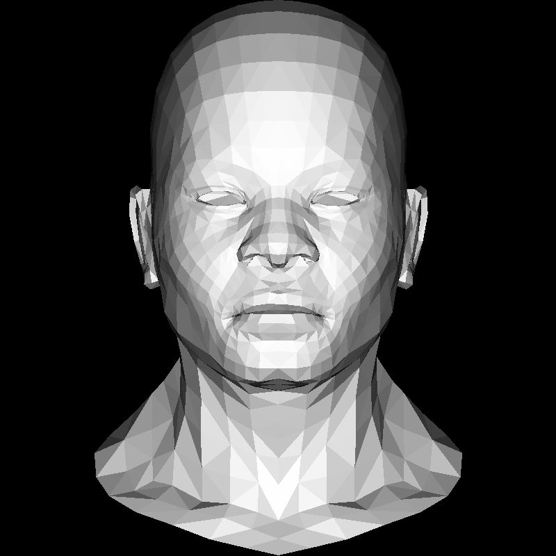

# tinyrender-golang

the golang implement of [tinyrenderer](https://github.com/ssloy/tinyrenderer)

**lesson 1-1**

**lesson 2-1**

**lesson 2-2**

**lesson 3-1**

**lesson 3-2**

**lesson 4-1**

**lesson 5-1**

